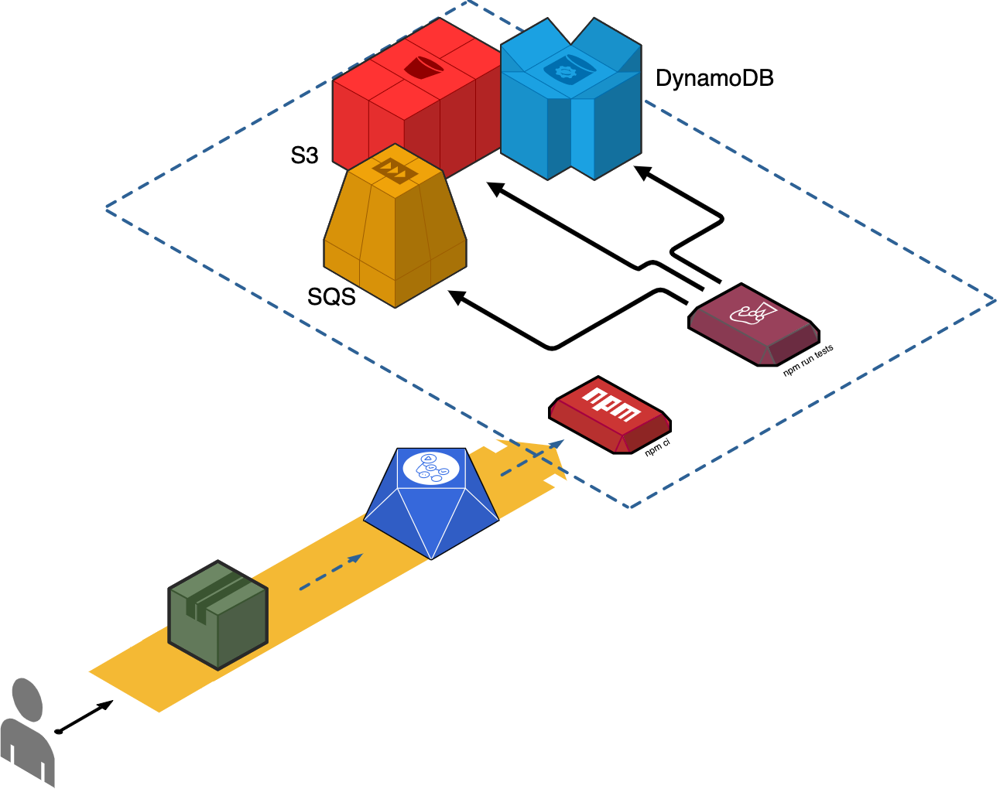

> Click To Watch ☝️ - How to run AWS services inside Github Actions | Introduction to Github Actions

# example-aws-services-github-worflows

> Example project of aws services setup in github workflows with nodejs and localstack

> CI pipeline provides example of integration tests utilizing dynamodb, sqs, and s3

## Resources
- [High-Level Diagram And Workflow Walk Through](https://youtu.be/-SKjWPEc-KQ)
- [Medium Article With Walk Through Of Code](https://medium.com/@meroware/aws-services-integration-testing-by-leveraging-local-stack-and-github-actions-801241ea9bf4)
- [Localstack](https://github.com/localstack/localstack) - Fully functional local AWS cloud stack which we use to host s3, sqs, and dynamodb in this example. Feel free to add more services depending on which aws resource you want to test with. NOTE: Read on the documentation of localstack to verify which services are in localstack/localstack image, or whether you need to use the full image localstack/localstack-full
- [AWS javascript SDK](https://docs.aws.amazon.com/AWSJavaScriptSDK/latest/AWS.html) - used for interacting with SQS and S3 services
- [Dynogels](https://github.com/clarkie/dynogels) - used in example as ORM for dynamodb. But you can use whatever you want to connect to dynamodb in the same way
